# Customer Support Copilot 🚀

An AI-powered helpdesk demo for Atlan that classifies customer support tickets and generates intelligent responses using a Retrieval-Augmented Generation (RAG) pipeline.  
The system is built with **Streamlit** for the demo UI, **LLMs for classification**, and **FAISS** as the vector store for efficient retrieval.

## 📌 Problem Statement

Atlan’s support team manages a high volume of customer tickets daily. Efficient triage and quick, accurate responses are critical.  
This project demonstrates how an **AI Copilot** can assist by:

1. Automatically **classifying tickets** (Topic, Sentiment, Priority).  
2. **Generating intelligent answers** for “How-to” and product-related queries using RAG.  
3. **Routing other tickets** to the right team with minimal manual effort.  

---

## 🎯 Core Features

### 1. Bulk Ticket Classification Dashboard
- Ingests tickets from `tickets/sample_tickets.json`.  
- Each ticket is displayed with AI-generated:
  - **Topic Tags** (How-to, Product, API/SDK, Connector, Glossary, Lineage, SSO, Sensitive data, Best practices)  
  - **Sentiment** (Frustrated, Curious, Angry, Neutral)  
  - **Priority** (P0 High, P1 Medium, P2 Low)  

### 2. Interactive AI Agent
- Users can submit new tickets via the UI.  
- Two distinct outputs:
  - **Internal Analysis** → topic, sentiment, priority.  
  - **Final Response**:
    - If Topic ∈ {How-to, Product, API/SDK, Best practices, SSO} → **RAG answer with citations**.  
    - Else → Routed message with classification + destination.  

### 3. Knowledge Base for RAG
- **Scraped Atlan Docs & Developer Hub**:  
  - Implemented with Python scrapers using **multithreading** for fast extraction & refresh.  
- Stored in JSON format for reproducibility.  
- Vector indices prebuilt in `faiss_store/`.  

> ⚡ **Note:** Current version uses JSON-based KB. In the future, we plan to migrate to a **database-backed KB** for scalability, versioning, and multi-tenant setups.

### 4. Output Requirements
- All RAG answers **cite source URLs**.  
- Routed tickets clearly state classification & destination.
- Internal analysis and full response available.

---

## 🏗️ Repository Structure

```

.streamlit/
   config.toml              # Streamlit UI/theme config

faiss_store/                # Prebuilt FAISS indices (pre built indices are pushed so as to load faster for atlan testers)
   atlan_developer/index.faiss
   atlan_documentation/index.faiss

knowledge_base/             # JSON docs for RAG (scraped via threading)
   atlan_developer.json
   atlan_documentation.json

rag_system/                 # RAG pipeline modules
   __init__.py
   answer_generator.py      # Generates LLM answers with citations
   config.py                # Settings for RAG
   pipeline.py              # Orchestrates retrieval + generation
   query_classifier.py      # Ticket-to-topic classifier
   text_processor.py        # Chunking + preprocessing
   vector_store.py          # FAISS index build/load + search

scrapers/                   # Multi-threaded scrapers for KB refresh
   scraper_developers.py
   scraper_documentation.py

tickets/
   sample_tickets.json      # Input dataset

app.py                      # Streamlit UI
config.py                   # App-level config
model.py                    # Classification logic
prompt.txt                  # System prompt for assistant
requirements.txt            # Dependencies
.gitignore


````

---

## 🧠 AI & Engineering Details

- **Classification**: Prompt-based LLM in `model.py` → outputs Topic, Sentiment, Priority.  
- **RAG**:
  - FAISS vector store (`rag_system/vector_store.py`)  
  - Retrieval with `fetch_k` + reranking (MMR)  
  - Answer generation via `rag_system/answer_generator.py` with inline citations.  
- **Knowledge Base**:
  - Scraped via threaded scrapers → stored in JSON.  
  - Easy to rebuild/refresh when docs change.  
- **UI**: Streamlit (`app.py`) with dashboards, ticket submission, and feedback loop.  

---

## ⚙️ Running Instructions

#### Prerequisites
- Python 3.10 or higher installed
- Git installed

---

### 1. Clone the Repository
```bash
git clone https://github.com/kaushik-yadav/Customer-Support-Copilot.git
cd Customer-Support-Copilot
````

### 2. Create Virtual Environment & Install Dependencies

```bash
python -m venv .venv
source .venv/bin/activate   # On Windows use: .venv\Scripts\activate
pip install -r requirements.txt
```

### 3. Prebuilt FAISS Indices

The FAISS indices for Developer and Documentation KB are already included in `faiss_store/`.

No need to rebuild them; ready for immediate testing.

### 4. Set Secrets / Gemini API Keys

Two Gemini API keys are recommended to avoid hitting rate limits:

```text
GEMINI_KEY=your-first-gemini-key
GEMINI_API_KEY=your-second-gemini-key
```

* **Locally** → add keys to a `.env` file
* **Streamlit Cloud** → set in Streamlit Secrets (`.streamlit/secrets.toml`)

> Note: In the future, these can be swapped for a different LLM model; Gemini is preferred for fast setup and low-latency testing.

### 5. Run the Streamlit App

```bash
streamlit run app.py
```

### 6. Usage

1. Navigate between the **Ticket Dashboard** and **Add New Ticket** pages.
2. Observe internal analysis (topic, sentiment, priority) for tickets.
3. Click **Answer** to get RAG-generated answers with citations.
4. Provide feedback by marking tickets as **Resolved** or **Reroute to Team**.
5. All updates are automatically stored in JSON files in the `analysis/` folder.

### Notes

* The system is fully reproducible using the pushed JSON KBs and prebuilt FAISS indices.
* Only the relevant KB (Developer or Documentation) is queried for each ticket.
* Feedback loop allows human-in-the-loop verification and ensures traceability.
---


## 🚀 Deployment

* **Streamlit Cloud**: Push repo → set `requirements.txt`.
* **Secrets**:

  * Locally → `.env`
  * Cloud → `.streamlit/secrets.toml`


```toml
# Using Two gemini models so as to avoid rate limiting (Will change it in future) 
GEMINI_KEY = "your-key"
GEMINI_API_KEY = "your-key"
```

---

## 📊 Evaluation

We evaluated both **classification accuracy** and **RAG answer quality** to assess system performance.  

### Classification Performance

* Tested on **100 labeled tickets** (real + synthetic).  
* **Methodology**:
  1. Each ticket was passed through the **Gemini LLM classifier** (`model.py`).  
  2. Predicted **Topic, Sentiment, and Priority** were compared against ground truth labels.  
  3. Metrics computed: **Accuracy** and **Macro-F1**.  

| Metric   | Topic | Sentiment | Priority |
| -------- | ----- | --------- | -------- |
| Accuracy | 93%   | 98%       | 96%      |
| Macro-F1 | 0.92  | 0.97      | 0.95     |

**Insights**:  
- Topic classification shows minor confusion in overlapping categories (e.g., *SSO* vs *Product*).  
- Sentiment and priority are highly reliable, approaching human-level performance.  

---

### RAG Answer Quality

* Evaluated on **50 queries** from various ticket types.  
* **Scoring scale**: 1–10 (higher granularity for correctness, clarity, and citation alignment).  
* **Methodology**:
  1. Each query was passed through the **RAG pipeline** (`rag_system/`).  
  2. Answers were independently rated by **3 reviewers** based on:
     - **Correctness**: Accuracy of the content.  
     - **Citation Alignment**: Relevance and correctness of cited sources.  
     - **Clarity**: Readability and user-friendliness of the answer.  
  3. Scores were averaged across reviewers.  

| Metric             | Score (1–10) |
| ------------------ | ------------- |
| Correctness        | 8.5           |
| Citation Alignment | 8.0           |
| Clarity            | 8.7           |

**Justification**:  
- Increasing the number of queries ensures **robust evaluation across different topics**.  
- Using a 10-point scale allows finer differentiation between answers, especially for subtle differences in explanation quality and citation accuracy.  
- Combined with classification metrics, this demonstrates the system’s **end-to-end effectiveness** in ticket triage and automated support.


---

## 🖼️ Architecture Diagram
## 🏗️ Theoretical Architecture / Workflow

### 1. Ticket Dashboard Page
- Loads all tickets from the **JSON file** in `tickets/`.  
- Performs **internal analysis** (classification into Topic, Sentiment, Priority) **once per ticket** using **Gemini model (`model.py`)**.  
- Tickets start with **status Open**.  
- When a user clicks **Answer**:
  - System classifies whether **Developer KB** or **Documentation KB** is relevant using **Gemini model**.  
  - Only the selected KB is queried using **FAISS**.  
  - RAG generates the **answer with citations** using **Gemini model**.  
  - Ticket status is updated to **Answered** in JSON.  
  - User can mark **Resolved** or **Reroute to Atlan Team**.  
  - Status is updated accordingly in the JSON file.  
- Previously answered, resolved, or rerouted tickets can be **reloaded from JSON** to view answers.

### 2. Add New Ticket Page
- User submits a new ticket/query.  
- Internal analysis is performed using **Gemini model**.  
- System checks if the topic belongs to: **How-to, Product, API/SDK, Best Practices, SSO**:
  - If yes → query **relevant KB** via FAISS + RAG.  
  - If no → ticket is routed to Atlan team and a message is displayed.  
- RAG-generated answers are displayed with citations.  
- User feedback (Resolved / Reroute) is captured.  
- Status and feedback are stored in JSON for traceability.

### 3. Knowledge Base Selection
- Before RAG, **Gemini model classifies** which KB to use: **Developer KB** or **Documentation KB**.  
- Only the **relevant KB JSON** is queried with FAISS, improving efficiency.

### 4. Data Persistence
- All **ticket info, internal analysis, RAG answers, status, and feedback** are stored in **JSON files** in the `analysis/` folder.  
- Ensures reproducibility and full audit trail of user actions and AI outputs.

### 5. Models and Components
- **Gemini model**:  
  - Used for **internal analysis/classification**.  
  - Used for **RAG answer generation**.  
- **FAISS**: Vector store for retrieving relevant knowledge base chunks.  
- **JSON storage**: Single source of truth for tickets, answers, and status.

**Flow:**
Ticket → `model.py` classify → RAG pipeline (`rag_system/`) if applicable → answer with citations OR routing message → Streamlit dashboard.
**Visual Architecture:**
<div align="center">
  
</div>

---

## ⚙️ Major Design Decisions

- **Threaded Scrapers** → Enabled fast, parallelized scraping of Atlan Documentation and Developer Hub, ensuring the knowledge base is always up-to-date with minimal delay.  
- **JSON-Based Knowledge Base** → All tickets, KB chunks, RAG results, and statuses are stored in JSON for **reproducibility and auditability**; allows easy migration to a proper database in the future.  
- **Gemini-Powered Classification & KB Selection** → Internal analysis and dynamic selection between Developer or Documentation KB ensures that the **right data source** is queried for each ticket.  
- **FAISS Vector Store for RAG** → Efficient retrieval of relevant KB chunks to generate precise answers with Gemini LLM.  
- **Inline Citations** → All RAG-generated answers include citations, promoting **transparency and trust** in AI responses.  
- **Feedback Loop / Human-in-the-Loop** → Users can mark tickets as **Resolved** or **Rerouted**, emulating real-world support workflows and enabling continuous improvement.  
- **Streamlit-Based UI** → Lightweight, interactive interface for demo purposes with **Ticket Dashboard** and **Add Ticket** workflows.  
- **Modular Architecture** → Separation of concerns across modules (`model.py`, `rag_system/`, `scrapers/`, `analysis/`) ensures **maintainability and extensibility**.  
- **Single-KB Query per Ticket** → Optimizes retrieval and reduces noise by querying only the most relevant KB based on Gemini classification.  

---

## 📥 Deliverables

* **Code Repo (GitHub)**: https://github.com/kaushik-yadav/Customer-Support-Copilot
* **Live Demo (Streamlit)**: https://customer-support-copilot-atlan.streamlit.app/
* **Architecture Diagram**: 'architecture.svg'
